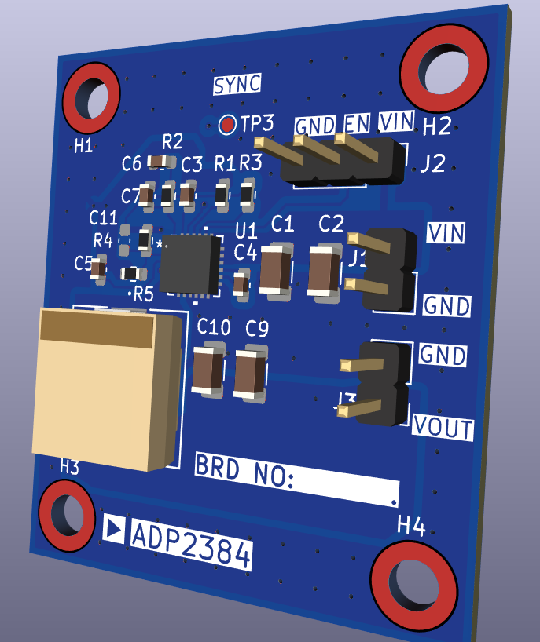
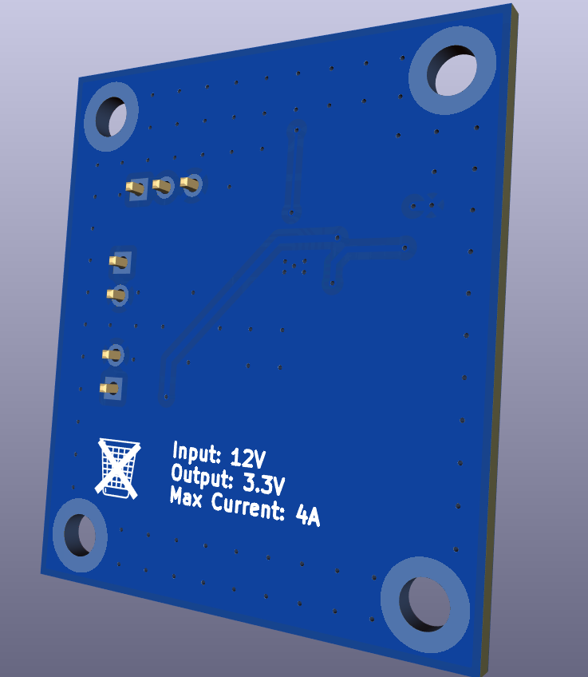

# ADP2384_EVL

Hardware design files for a **12 V → 3.3 V @ 4 A** DC-DC buck converter based on the **Analog Devices ADP2384** designed using KiCad.

---

## 🧭 Overview

This project contains the complete design package — schematic, layout, and simulation files — for a compact, high-efficiency step-down converter using the ADP2384 synchronous buck regulator.  

---

## ⚙️ Board Specifications

| Parameter | Specification |
|------------|---------------|
| Input Voltage | 12 V |
| Output Voltage | 3.3 V |
| Output Current | Up to 4 A |
| Regulator IC | ADP2384 |
| Board Dimensions | 35 mm × 40 mm |
| PCB Layers | 2 layers |
| Assembly | Single-sided |

---

*3D render of the ADP2384_EVL board (35 × 40 mm)*

*Front Side*

  

*Back Side*

  

---

## 📂 Repository Structure
/

├── Board_Files/ # Schematics, BOM, PCB layout and Gerbers

├── Simulation_Files/ # LTspice file

├── TechRef/ # Datasheets and application notes

├── images/ # Renders, photos, documentation images

├── LICENSE

└── README.md
